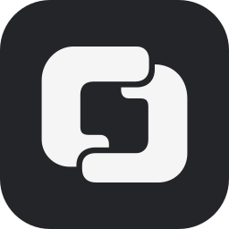

<p align="center">
  
</p>

<h1 align="center">ACPilot</h1>

<p align="center">
  A home for coding agents in VS Code / Cursor.<br>
  Grok, Devin, Kimi Code, and more — connected through ACP.
</p>

<p align="center">
  <strong>English</strong> · <a href="README.zh.md">简体中文</a>
</p>

<p align="center">
  <a href="#usage">Getting started</a> · <a href="#development">Development</a>
</p>

## Overview

A chat shell that lives in the VS Code / Cursor secondary sidebar and drives official agent CLIs over [ACP](https://agentclientprotocol.com) (JSON-RPC over stdio):

- `grok agent stdio`
- `devin acp`
- `kimi acp`
- any ACP-compatible command (added via the `acpilot.agents` setting)

The shell handles UI, session organization, permission approvals, accounts, and context budget. Model calls, agent execution, and context compaction itself are left to the CLIs.

## Usage

1. Install the CLIs (log in to Grok / Kimi in their own terminals; for Devin see below)
2. Open the ACPilot view in the secondary sidebar; switch agent / mode / model from the toolbar below the composer
3. Type and send; messages sent mid-turn are queued; the square button cancels

### Images and files

- Paste or drop images (PNG · JPEG · GIF · WebP, ≤ 10 MB): they go inline as base64. Grok advertises `image: false` in `initialize` yet sees them fine, so the flag is ignored
- Drag files from the Explorer into the composer, or type `@` to search workspace files: sent as `resource_link`, the agent reads them itself (dropped image files are read and sent as images)
- Text files dropped from Finder (≤ 256 KB): a webview has no path for them, so the content is embedded as a `resource` block; binaries are refused

Transcripts live in the extension's globalStorage. On restart, sessions try `session/resume` first, then `session/load`, and fall back to read-only history if neither is supported.

### Multiple Devin accounts

Devin's ACP mode does not read the local CLI login — credentials are handed to it by ACPilot when a session starts — so you can store several accounts and switch per session (when one Max quota runs out, switch to another):

- The lower section of the agent Chip menu is the account list: pick one to start a new session with it. "Import local CLI login" reads `~/.local/share/devin/credentials.toml`; "Log in a new account in the terminal…" runs `devin auth login` once in an isolated directory without touching your local login (also works on servers: copy the link, paste the code)
- Secrets only ever go to the OS keychain (VS Code SecretStorage); `accounts.json` holds metadata like email and plan, and transcripts store only the account id
- A session is bound to one account from start to finish. The "Log in with browser (this session only)" option on the Notice is Devin's own browser login — it authenticates the current process only and is not saved

### Auto-compaction

When context usage reaches `acpilot.compactAtTokens` (default 300k) after a turn, ACPilot automatically sends `/compact` to the agent (`acpilot.autoCompact`, on by default); you can also compact manually from the context ring. Only applies to agents that report usage and expose a `/compact` command (Devin / Grok both do).

## Development

```sh
pnpm install
pnpm build          # host (esbuild) + webview (Vite)
pnpm probe grok     # run initialize + session/new against a CLI directly
pnpm probe devin --import-local "Reply pong"   # via the account layer: import local login → authenticate → one turn
pnpm typecheck && pnpm test
pnpm package        # build a .vsix
```

Press F5 to launch an Extension Development Host. Logs are in Output → ACPilot. See [AGENTS.md](AGENTS.md) for the architecture map and protocol gotchas.
